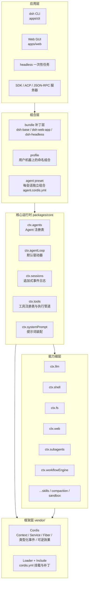
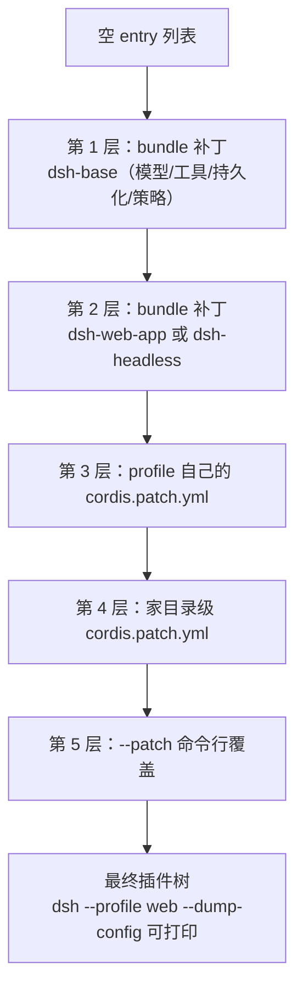
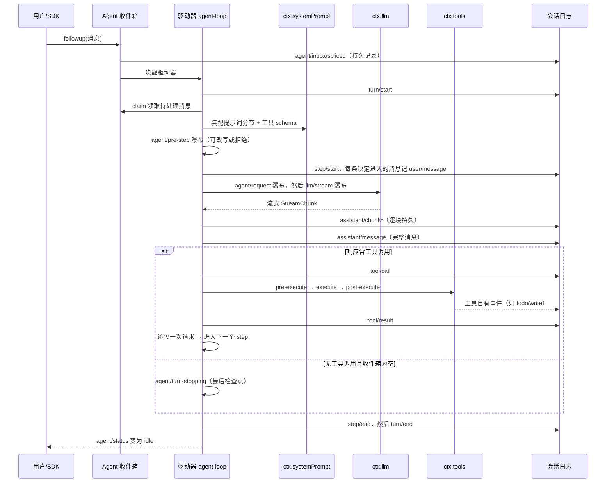
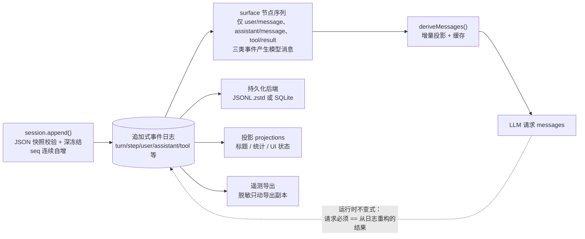
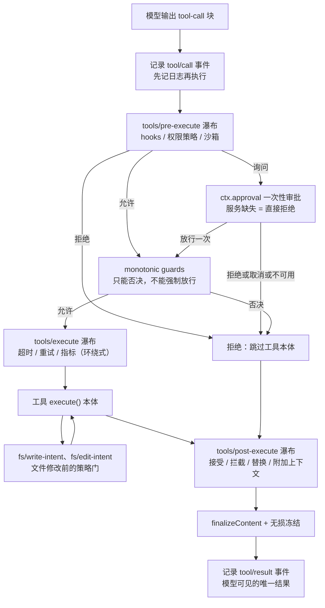
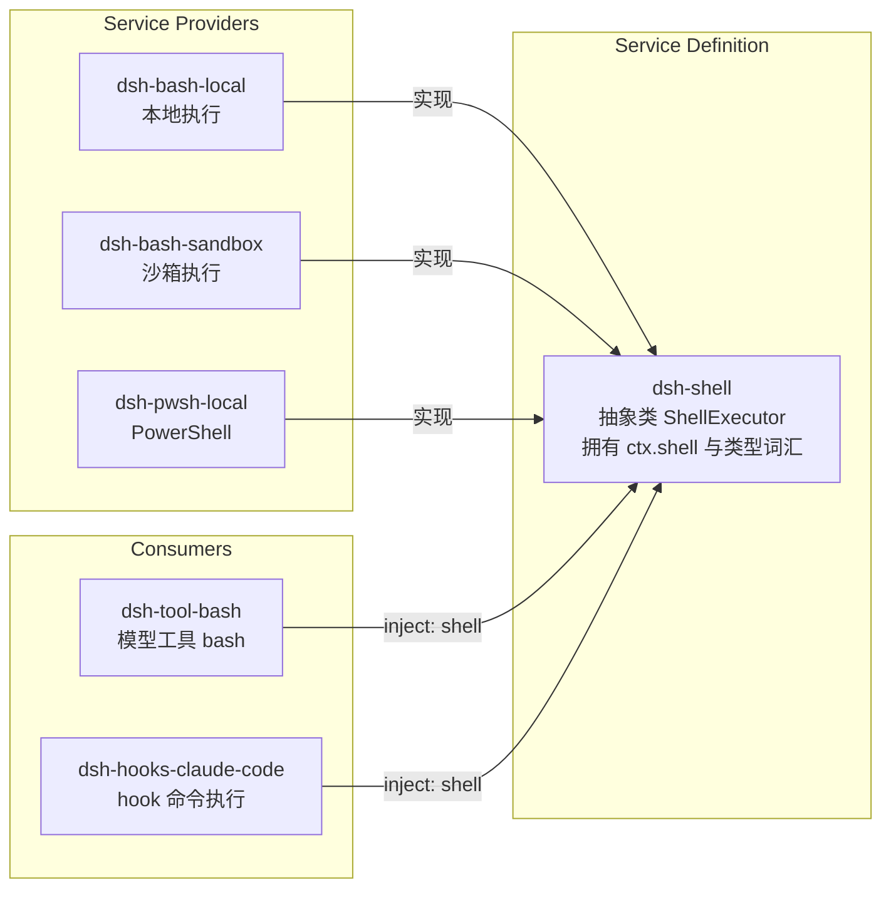
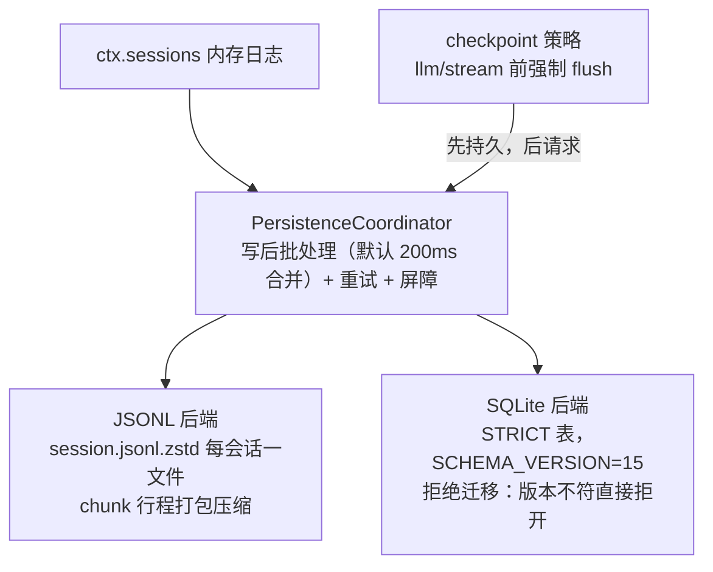
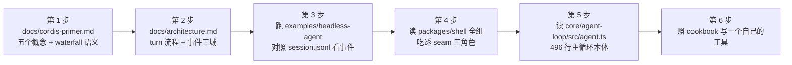

# DeepSeek Harness 技术学习文档

> 本文档是对本仓库的整体性技术分析，面向想要读懂 / 学习这套架构的工程师。内容涵盖：代码结构、技术架构图、数据流程图、设计亮点与创新点、学习路径建议。
> 所有 Mermaid 图均使用默认主题配色，在明暗两种主题下都可清晰渲染。

---

## 目录

1. [一句话认识这个项目](#1-一句话认识这个项目)
2. [代码结构说明](#2-代码结构说明)
3. [技术架构总览](#3-技术架构总览)
4. [核心运行时：Agent 循环](#4-核心运行时agent-循环)
5. [数据流程图](#5-数据流程图)
6. [能力缝（Capability Seam）设计模式](#6-能力缝capability-seam设计模式)
7. [会话持久化与投影](#7-会话持久化与投影)
8. [设计亮点与创新点](#8-设计亮点与创新点)
9. [学习路径建议](#9-学习路径建议)

---

## 1. 一句话认识这个项目

**DeepSeek Harness（dsh）是一个"一切皆插件"的 Agent 运行框架**：模型适配器、工具注册表、会话日志、甚至 Agent 主循环本身，全部都是可从配置文件替换的插件，底座是源码内置（vendored）的 Cordis 插件框架。

用大白话讲：大多数 Agent 框架有一个"写死的核心"，你只能在它开的口子上做扩展；而 dsh 没有特权核心——你想改哪一块，就换掉那一块的插件，其余部分完全不动。

三个最重要的心智模型：

| 心智模型 | 含义 |
|---|---|
| **一切皆插件** | 没有特权核心，主循环 `agent-loop` 也只是一个可替换的插件 |
| **事件日志是唯一真相源** | 模型看到的一切都必须能从会话日志逐字节重建（"模型可见 ⟺ 已记录"不变式，有运行时断言强制执行） |
| **能力缝三角色** | 每个能力 = Service Definition（接口）+ Service Provider（实现）+ Consumer（使用方，通常是模型工具），换一个 Provider 就换掉整个执行世界 |

---

## 2. 代码结构说明

### 2.1 顶层目录

```
deepseek-harness/
├── vendor/       内置的 Cordis 框架源码（9 个包，钉死版本，可审计可打补丁）
├── packages/     所有业务包，两级结构 packages/<组>/<包>，npm 名统一 @deepseek-ai/dsh-<包>
├── apps/         可执行应用：cli（dsh 命令）、web（浏览器界面）
├── examples/     可运行的 cordis.yml 叶子组合（headless / acp / jsonrpc / web-cordis 等）
├── python/       Python SDK 与打包的运行时
├── native/       Landlock 沙箱原生启动器（~300 行 C，musl 静态链接）
├── docs/         架构文档、生成的目录（catalog）、事故复盘、cookbook
├── .agents/      Agent 工作流与设计决策记录（Agent Notes）
├── scripts/      仓库门禁（gate）与代码生成器
└── website/      VitePress 双语文档站
```

### 2.2 packages/ 分组地图（按职责归类）

**核心脊柱（core spine）** —— 产品 API 的骨架：

| 包 | ctx 键 | 职责 |
|---|---|---|
| `core/session` | `ctx.sessions` | 追加式 `SessionEvent` 日志 + 内存会话仓库，**整个系统的真相源** |
| `core/system-prompt` | `ctx.systemPrompt` | 提示词分节 / 变量 / 工具 schema 的装配注册表 |
| `core/tools` | `ctx.tools` | 带作用域的工具注册表 + 受守卫的执行管道 |
| `core/agent` | `ctx.agents` | `Agent` 接口、活体注册表、`agent/*` 事件词汇 |
| `core/agent-loop` | `ctx.agentLoop` | 实现 Agent 接口的**默认驱动器**（可整体换掉） |
| `core/scope` | （库，无键） | 按 Agent 作用域注册的底层原语 |

**能力缝家族（capability seams）** —— 每组都是"接口 + 实现 + 工具"三件套：

| 组 | ctx 键 | 能力 | 典型实现 |
|---|---|---|---|
| `llm/` | `ctx.llm` | 模型流式调用 | DeepSeek / pi-ai 适配器、测试回放适配器 |
| `shell/` | `ctx.shell` | bash 执行（**模式模板**） | bash-local / bash-sandbox / pwsh-local |
| `subprocess/` | `ctx.subprocess` | 子进程（进程树管理） | 本地实现、E2B 远程实现 |
| `fs/` | `ctx.fs` | 文件系统 12 原语 | fs-local / fs-sandbox / fs-e2b |
| `web/` | `ctx.web` | 搜索 + 抓取 | exa / perplexity / deepseek / http |
| `subagent/` | `ctx.subagents` | 子 Agent 委派 | 进程内 spawn/fork、ACP、Codex、Claude Code |
| `workflow/` | `ctx.workflowEngine` | 确定性多 Agent 编排脚本 | worker-thread 引擎 |
| `skill/` | `ctx.skills` | 技能目录与加载 | 文件系统 provider |
| `compaction/` | `ctx.compaction` | 上下文压缩 | basic provider |
| `terminal/` | `ctx.terminals` | 持久 PTY 会话 | 本地实现 |
| `lsp/` | — | 语言服务器 | 通用 stdio provider |
| `sandbox/` | `ctx.sandbox` | 进程约束 | bwrap / Landlock / Seatbelt |

**数据与外围**：

| 组 | 职责 |
|---|---|
| `session/` | 持久化（JSONL.zstd / SQLite）、投影（projection）、标题生成、遥测 |
| `preset/` | **每会话独立组合**：一个 `agent.cordis.yml` 决定一个会话的工具/人设 |
| `extensions/` | **自我修改**：模型检查并挂载自己的插件（`cordis_inspect/define/run` 工具） |
| `interaction/` | 人机协作面：审批（approval）、提问、人类命令（`/compact` 之类） |
| `guard/` | 循环卫生：重复调用提醒、工具超时执行器 |
| `hooks/` | Claude Code / Codex 外部 hook 协议桥接 |
| `boot/` + `bundle/` | 启动胶水 + 可安装的 `--profile` 补丁层 |
| `sdk/` / `acp/` / `api/` | JSON-RPC SDK、Agent Client Protocol 服务器、Web BFF |
| `typert/` | 编译期类型图生成 + 运行时类型注册表（RPC 校验用） |

### 2.3 一个包内部长什么样

```
packages/shell/tool-bash/
├── src/
│   ├── index.ts        插件入口（Service 子类默认导出，或 name/inject/apply 具名导出）
│   ├── types.ts        纯类型，无运行时代码
│   └── invariant.ts    包自有的运行时不变式检查（每个包必须有 ./invariant 导出）
├── tests/              测试在包级 tests/，不在 src/__tests__/
├── README.md           含 Model Experience 小节（这个包对模型/token/KV 缓存的影响）
└── package.json        @deepseek-ai/dsh-tool-bash，ESM，cordis 为 peerDependency
```

---

## 3. 技术架构总览

### 3.1 分层架构图



### 3.2 底座：Cordis 的五个核心概念

Cordis 是 vendored（源码复制进仓库、重命名为 `@deepseek-ai` scope、钉死提交号）的插件框架。理解它只需要五句话：

1. **插件就是实现 Service 的对象** —— 可以是带 `inject` / `apply(ctx)` 的函数，也可以是 `Service` 子类。
2. **Context 是服务仓库** —— 服务认领一个稳定的 `ctx.<key>`（如 `ctx.tools`），别的插件按键找服务，不 import 具体实现。
3. **依赖用 `inject` 声明** —— 声明了依赖的插件会等服务就绪才挂载，启动顺序由依赖关系表达，不用手工排序。
4. **类型化事件通信** —— 通过 TypeScript 声明合并（declaration merging）声明事件名，按语义选 `emit` / `waterfall` / `parallel` / `serial` 四种派发模式。
5. **注册即可逆效果** —— 一切注册（提示词分节、工具 schema、适配器、监听器）都走 `ctx.effect()` / `ctx.on()`，插件卸载时自动、可预测地回退。

其中 **waterfall（瀑布）** 是最有味道的：它是环绕式中间件，监听器拿到 `(...args, next)`，调 `next()` 表示放行给下一个，不调就短路——权限决策、请求改写、hook 桥接全靠它。

### 3.3 启动组合：profile / bundle 补丁层

一个运行中的 `dsh` 进程 = 一棵在启动时按层组合出来的插件树。每一层都是对 entry 列表的补丁（按 id 替换整行 config，或插入新行）：



关键点：`--dump-config` 打印的组合与真实启动的树**共用同一个补丁算法**（vendored include 包导出的 `applyEntryPatches` 纯函数），配置工具永远不会与实际启动结果漂移。这是"宁可改 vendor 也不允许两套实现"的典型决策。

---

## 4. 核心运行时：Agent 循环

### 4.1 概念：turn 与 step

- **step（步）**= 一次模型请求 + 该响应触发的所有工具执行。
- **turn（轮）**= 一次输入的完整消化过程，包含 0 到多个 step，直到模型自然停止或策略终止。

### 4.2 完整时序图



### 4.3 驱动器内部的关键机制（说人话版）

- **收件箱（Inbox）有两条队列**：`next-turn`（下一轮才处理）和 `next-step`（当前轮的下一步就插入，用于 steering/注入上下文）。每次变动都持久记录 `agent/inbox/spliced`，重启后收件箱状态靠**重放这些事件**重建——连"待办消息"都不丢。
- **`agent/pre-step` 是模型看到什么的最终裁决者**：监听器可以改写领取到的消息，也可以整批拒绝。压缩（compaction）就挂在这里：请求前检测上下文压力，先剪工具结果再做摘要。
- **模型历史不是存的，是推导的**：每个 step 用 `session.deriveMessages()` 从日志的 surface 节点投影出 messages 数组。历史没有第二份拷贝，就不存在"存的和发的不一致"这种 bug 类别。
- **工具调用调度**：模型一次输出多个工具调用时，按每个调用活体查询 `isConcurrencySafe(args)` 分组——并发安全的进滚动池（容量可配 `maxParallelToolCalls`），不安全的独占执行；**派发可以乱序重叠，但结果严格按模型输出顺序提交**，保证日志与模型视角一致。中止时给所有未派发的调用写入合成的 ABORTED 结果，重放永远合法。
- **失败恢复**：模型请求失败走 `agent/request-error` 瀑布，重试插件（llm-retry）、压缩插件都可以返回 `{kind:'retry'}` 抢救；没人接就如实关轮，`turn/end` 带上错误原因。

---

## 5. 数据流程图

### 5.1 会话日志：单一真相源的数据流



几个值得记住的细节：

- **写入即校验**：`append()` 先做一遍递归 JSON 校验拷贝（非 JSON 数据在调用点就抛错，坏事件永远到不了持久化层），再深冻结、编 seq、提交，最后才通知监听器（监听器异常被逐个包住，不影响日志本身）。
- **surface 操作是强类型的**：三类"模型可见"事件**必须**携带 `surfaceOp`（`append` 或 `{replace, start, end}`），其他事件携带即报错。压缩就是一次 `replace`：新摘要节点替换一段旧节点，被替换事件的 seq 全部列在 `sourceEventSeqs` 里，可审计可回放。
- **先落盘再发请求**：checkpoint 策略插件包裹 `llm/stream`，保证已记录的请求前缀**在适配器发起网络请求之前**已持久——"已记录"在时间上也先于"模型可见"，不只是内容上等价。

### 5.2 工具执行管道



这条管道的设计精髓：

- **策略与工具解耦**：hook、审批、沙箱都挂在通用的 pre/post 瀑布上，跨所有工具族生效，工具本体不知道任何一种策略的存在。
- **guard 是单调的**：守卫只能给出"否决理由"或弃权，没有任何守卫能强制放行——安全策略只会越叠越紧。
- **审批 fail-closed**：`ctx.approval` 服务不存在或无人应答时，`ask` 直接落到拒绝，不是放行。
- **超时零配置**：超时执行器从工具自己声明的 `ToolDefinition.timeoutMs` 读预算（从注册表读回，写错工具名都不可能），armed 一个 deadline signal 环绕派发。

### 5.3 请求构建：`request/header` 去重记录

每个 step 构建请求时：种子配置 → `agent/request` 瀑布（插件可改模型、温度等）→ `prepareCall` → 规范化 header → **只在与上次不同的时候**才追加 `request/header` 事件（原因标为 `initial` / `resume` / `change`）。这样日志既完整（任何配置变化都有据可查），又不被逐步重复的 header 灌爆。

---

## 6. 能力缝（Capability Seam）设计模式

这是本仓库最值得学习的一个自创模式，术语表里给了严格定义：**seam = 三个角色的完整组合，缺一不叫 seam**。

### 6.1 三角色结构（以 shell 为例，官方模板）



规则：

- Service Definition 永远是 Cordis `Service` 类（抽象类或具体注册表），**绝不是裸 TypeScript interface**——这样 Cordis 的重复服务检测和 fiber 卸载机制自动适用。
- Consumer 只依赖 Definition，**永远不 import Provider 的类型**。
- "为所有 Consumer 设计 Definition"：不许某一个 Consumer 的需要绑架服务契约。

### 6.2 Definition 的三种形态

| 形态 | 代表 | 适用场景 |
|---|---|---|
| 抽象类，每个 Context 一个实现 | `ShellExecutor`、`FileSystem`、`CompactionEngine`、`WorkflowEngine` | 能力单一、重复挂载应报错 |
| 具体注册表 + N 个具名 provider | `LlmRuntime`、`WebRuntime`、`SubagentRuntime`、`SkillRegistry` | 多实现并存、按名/策略选择 |
| 纯事件门（无注册 provider） | `ctx.approval` 应答者、fs 策略层、guard 家族 | 需要优雅降级或 fail-closed 的策略点 |

### 6.3 request/spec 拆分：显式默认值模式

这是包边界处理"默认值"的官方模板（`dsh-shell` 首创，`subprocess` 明文引用）：

```
ShellExecRequest（调用方视角）          ShellExecSpec（执行视角）
  command   必填                        command        必填
  workdir?  可选          resolve()     workdir        必填（已定值）
  timeoutMs? 可选       ─────────►      timeoutMs      必填（已钳制）
  sandboxPolicy? 可选                   sandboxPolicy  必须在场但可为 undefined
```

- 所有默认值填充集中在 Provider 的 `resolve(request): spec` 这**一个显式步骤**里，`run()`/`start()` 类型上只收 spec——**不可能**在深处偷偷再 `?? default` 一次。
- `sandboxPolicy` 是"必须在场但可空"：不做沙箱的执行器也必须**看见并显式忽略**这个字段，而不是根本不知道它存在。
- 沙箱子类的 override 只有一行：`{ ...super.resolve(request), sandboxPolicy: request.sandboxPolicy ?? this.ctx.sandboxPolicy.resolve() }`——分层默认值组合得干干净净。

### 6.4 能力事实如何塑形模型工具

Consumer 在注册期读取 seam 的"能力事实"，据此裁剪暴露给模型的 schema，全程不 import Provider：

- `ctx.shell.sandboxMode !== undefined` → bash 工具才向模型宣告 `sandbox_permissions` / `justification` 参数；
- 路由的模型声明支持图像输入且挂载了附件服务 → 才注册 `read_image` 工具；
- 存在 `ctx.codeRuntime` → 工具改用 Code Mode 的 `run_code` 传输，原生 function-calling schema 整组撤下。

### 6.5 换一个 Provider = 换一个世界

文件系统和子进程 Provider 共享同一个"执行世界"。把这两个 seam 指向 E2B 远程沙箱后：`bash` 工具、持久终端、LSP 全部自动跟着到了远端，**零 fork**——因为它们从头到尾只调 `ctx.fs` / `ctx.subprocess`，不碰 node:fs / child_process。

---

## 7. 会话持久化与投影

### 7.1 持久化架构



- **两个版本号，各管一摊**：`SESSION_FORMAT_VERSION`（目前恒为 0）管事件词汇结构；SQLite `SCHEMA_VERSION` 管表结构，单调递增、只拒不迁。词汇的**增长**则按事件处理：未知事件类型默认"读取时必须认识"，除非事件自带 `ignorable: true`——旧版本读到看不懂的关键事件会拒绝整个日志，而不是默默丢弃。
- **assistant 的流式 chunk 无损保存**：连续 chunk 在存储层打包成行程（run-length）行，重放 UI 能逐字复现打字机效果，但不牺牲存储体积。

### 7.2 投影（Projection）框架

领域包只提供三个**同步纯函数**：`init()`、`apply(state, event)`、`view()`；框架负责订阅、水位线、变更通知。规则很硬：**携带状态的日志事件必须带完整的变更后状态，不许只带增量**——这样任何投影都能从任意点独立追赶。

投影缓存（`session_projcache`）是纯粹的折叠捷径：fail-soft 写入、版本不符直接丢弃重算、**日志永远先于缓存落盘**——缓存丢了顶多慢一点，绝不可能错。

---

## 8. 设计亮点与创新点

### ⭐ 8.1 "模型可见 ⟺ 已记录"——用运行时断言强制的可重构性

大多数框架把"日志"当副产品；dsh 把它当**宪法**，而且不只是口号：

`agent-loop` 的 invariant 插件以 `prepend` 方式（防止被短路监听器绕过）挂在 `llm/stream` 瀑布最前面，对每个主循环请求断言：

```
JSON.stringify(request.messages) === JSON.stringify(session.deriveMessages())
```

外加模型 / system / 温度 / 工具 schema 与折叠后的 `request/header` 逐项相符。**任何插件想给模型塞一段日志里没有的内容，进程当场报错**。这带来的能力：会话 fork、精确 resume、逐字节回放测试（keyless snapshot）、可信遥测，全部免费获得。

### ⭐ 8.2 无特权核心：主循环也是插件

`agent-loop` 通过 `ctx.agents.setFactory(this)` 把自己注册为工厂，所有 UI / hook / 工具插件只依赖 `dsh-agent` 的接口，不依赖具体循环。想实验一个完全不同的调度策略？写个新插件替掉这一行配置即可，其余上百个插件不改一字。

### ⭐ 8.3 Scope 机制：一个进程跑多个"不同人格"的 Agent

`core/scope` 提供两层扁平作用域（全局 / 每 Agent），配合三条规则：

- **shadowing**：作用域内注册的同名工具/提示词分节遮蔽全局版本——每 Agent 人格、每 Agent 工具变体的实现基础；
- **restriction**：`tools.restrict` 按交集过滤全局工具集，被滤掉的工具在提示词里不出现、执行时也拒绝，与不存在无法区分（枚举 = 执行，一处决策）;
- **scoped dispatch**：关于某个 Agent 的事件带着它的 scope carrier 派发，挂在 `agent.ctx` 上的监听器只看到自家事件。

**agent preset** 在此之上实现"每会话独立组合"：一个目录一个 `agent.cordis.yml`，进程内首次使用时挂载为常驻子树，后续会话通过 scope 父链"加入"该组合——一个进程同时跑 minimal / code / cordis 三种装备的 Agent，注册只存在一份。

### ⭐ 8.4 自我修改：Agent 检查并改写自己的运行时

`packages/extensions/` + `cordis` preset 让模型拥有 `cordis_inspect` / `cordis_define` / `cordis_run` 等工具：

- `inspect` 把**编译期生成的 API 目录**（与文档站同一 AST walk 生成，有新鲜度门禁）与**活体服务仓库**求交——模型看到的能力清单永远与文档、与真实运行状态三方一致；
- `define/run` 在 `node:vm` 沙箱 + 独立 fiber 里评估模型写的插件，浏览器半侧要跑必须经人类点头；
- 记忆策略克制：会话日志只记 define 的**元数据不记代码**，进程重启后定义合法消失——自我修改是实验台，不是持久化后门。

### ⭐ 8.5 Landlock 自限制启动器：约束别人先约束自己

`native/landlock-run` 是 ~300 行 C：先给**自己**装上 Landlock 规则集，再 `exec` 目标命令——规则集跨 `execve` 继承，整棵子进程树被约束，而 harness 主进程不受影响。**fail-closed**：内核不支持就拒绝运行而非裸奔；没有安装期编译回退，平台包缺失时 `probe()` 报 `unusable`，消费方落向关闭。

### ⭐ 8.6 Vendored 框架层：完全拥有你的地基

Cordis 及其 8 个配套包源码复制进 `vendor/`，重命名 scope、钉死上游 commit，**18 处本地修改逐条登记在案**（包括 fiber 重入卸载加固、配置事务化回滚、`!!js` 惰性求值等实打实的深水区修复）。哲学：Agent 框架的地基出问题时，等上游发版是不可接受的；可审计、可打补丁、随产品一起发布。

### ⭐ 8.7 显式大于隐式的一组微模式

- **request/spec resolve 拆分**（见 6.3）：默认值只能在一个显式步骤发生；
- **品牌化 ID**：跨边界的不透明 id 一律 `Branded<B>`，编译期就防串号；
- **配置错误大声失败**：能自检的加载时抛，不能的在最早可解析点抛，绝不静默跳过；
- **空 catch 必须写明吞的是什么、为何没别的能到这**；
- **深度信任 TypeScript**：进程内类型化边界不加运行时校验，校验只放在解析器/模型 JSON/持久化/进程/网络这些真边界——校验密度本身是架构信息。

### ⭐ 8.8 每包自带运行时不变式 + 文档即门禁

每个包必须导出 `./invariant` 伴生插件，注册**事件流层面的关系检查**（turn/step 包围、call/result 配对、状态机转移合法性……），CI 门禁 `verify-package-invariants` 确保没有包裸奔。同时：事件目录、能力缝图、配置目录、模块依赖图全部由脚本生成并做新鲜度校验——**文档不可能过时，因为过时就红灯**。

### ⭐ 8.9 双引擎多 Agent：workflow（确定性）× subagent（能力协商）

- `workflow` 是确定性编排：JS 脚本 + `agent()/parallel()/pipeline()` 原语在 worker-thread 里跑，事件只带 info 不带活体句柄（观察者拿不到 cancel 权限）；
- `subagent` 是具名 provider 注册表，provider 声明能力集（`outputSchema` / `toolFilter` / `persona`…），甚至用**可选方法的存在性**（`prepareContinuable?`）作为能力探测——把另一个产品（Codex、Claude Code）整个包装成一个 provider；
- 两者正交组合：workflow 脚本里的 `agent()` 调用透明路由到配置的 subagent provider。Ralph 循环（不断开新鲜子会话冲同一目标）就是纯组合出来的策略，主循环零改动。

### ⭐ 8.10 收件箱可重放、审批入日志、hook 有对账

一些小而美的一致性设计：收件箱状态靠重放 `agent/inbox/spliced` 重建（重启不丢排队消息）；每次审批在日志里留 `approval/asked`/`approval/decided` 配对审计记录；每次外部 hook 执行留 `hook/invoked`/`hook/result` 配对记录，多 hook 输出按 **deny > ask > allow** 合并。系统里几乎每个"发生过的事"都能对账。

---

## 9. 学习路径建议

按依赖顺序由浅入深：



| 阶段 | 材料 | 你会得到 |
|---|---|---|
| 入门 | `docs/cordis-primer.md`、`docs/cordis-tutorial/` | 插件/服务/事件/效果的语感 |
| 骨架 | `docs/architecture.md`、`docs/agent-lifecycle.md`、`docs/tool-execution-pipeline.md` | turn/step 模型与两条官方 Mermaid 图 |
| 动手 | `pnpm dsh --profile headless "任务"`（需 `DEEPSEEK_API_KEY`）、`examples/` | 真实事件日志长什么样 |
| 模式 | `packages/shell/`（seam 模板）、`docs/glossary.md`、`docs/capability-seams.md` | 三角色模式 + request/spec 拆分 |
| 深水 | `packages/core/agent-loop/src/agent.ts`、`packages/core/session/src/index.ts`、`packages/core/agent-loop/src/invariant.ts` | 主循环、日志与"模型可见⟺已记录"断言的真身 |
| 决策考古 | `.agents/notes/implemented/` | 每个非显然设计背后的 why |
| 扩展 | `docs/cookbook/adding-a-tool.md`、`adding-a-package.md` | 亲手加一个工具/一个包 |

三个特别值得"带着问题读"的文件：

1. `packages/core/agent-loop/src/agent.ts` —— 问：一条消息从收件箱到 LLM 请求经历了哪几次改写机会？
2. `packages/core/session/src/surface.ts` —— 问：压缩替换一段历史后，`deriveMessages()` 的缓存如何失效重建？
3. `apps/cli/config/agent-presets/cordis/agent.cordis.yml` —— 问：哪些行属于"宿主平面"，哪些属于"每会话平面"，为什么？（文件内注释是全仓库最好的两平面教学）

---

*本文档基于 2026-08-13 的代码仓库状态（master 分支）分析生成。仓库自身的权威文档在 `docs/`，本文侧重学习视角的整体串讲；若与 `docs/` 冲突，以 `docs/` 为准。*
